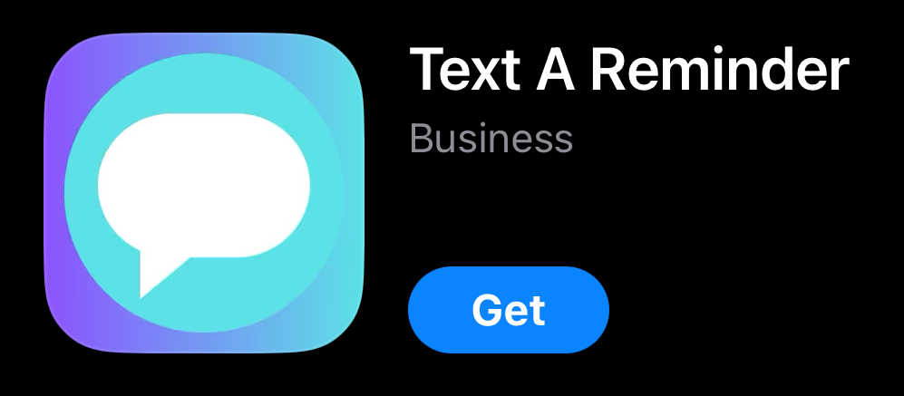

## Mihir Gupta

**`Creating Apps, Shaping Futures (Mobile App Developer/iOS/Cross Platform)`**

I'm an experienced iOS developer with a proven track record of independently managing full-cycle app development. Currently serving as the product owner and sole developer of an educational game for a non-profit associated with Arizona State University, I oversee every aspect of design, development, and deployment using Unity and Swift. My portfolio includes creating impactful solutions like Text A Reminder, a productivity iOS app for small businesses, and collaborating on NGO projects to improve literacy for underprivileged children. Skilled in Agile methodologies, I specialize in crafting user-focused, innovative mobile applications.

---

### 🧰 Languages and Tools

            

 

#

### 🚀 Latest Projects  

#### [Text A Reminder](https://apps.apple.com/us/app/text-a-reminder/id6468889952)  
*Text A Reminder* is a productivity app designed for small business professionals to manage appointment scheduling and reminders via SMS. Built with Swift and integrated with Firebase and iOS Calendar (EventKit API), this app simplifies client communication with automated reminders sent through iMessage.  

---
### :fire: My Stats :

<!--

**gupta-mihir/gupta-mihir** is a ✨ _special_ ✨ repository because its `README.md` (this file) appears on your GitHub profile.

Here are some ideas to get you started:

- 🔭 I’m currently working on ...
- 🌱 I’m currently learning ...
- 👯 I’m looking to collaborate on ...
- 🤔 I’m looking for help with ...
- 💬 Ask me about ...
- 📫 How to reach me: ...
- 😄 Pronouns: ...
- ⚡ Fun fact: ...
-->
